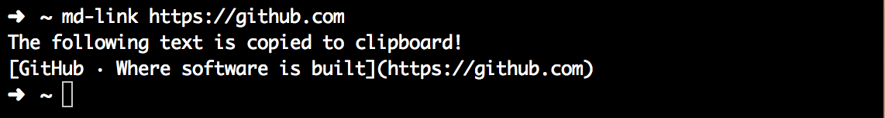

# md-link

A command like tool to generate a [Markdown link](https://daringfireball.net/projects/markdown/syntax#link) for the given URL.



## Install

```
$ npm install md-link -g
```

## Example

The `md-link` command takes a URL as first argument, and generates the Markdown link text.

```
$ md-link https://github.com/
[GitHub · Where software is built](https://github.com/)
```

## Debugging

To enable debug logging, launch the node process with `DEBUG=true` followed by the command.

```
$ DEBUG=true md-link
```
